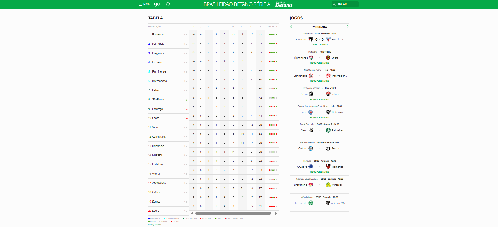
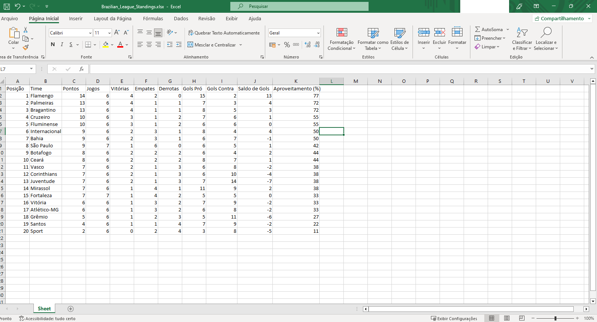

## Brasileirão Scraper to Excel

Este projeto realiza _web scraping_ dos dados da classificação do Campeonato Brasileiro de Futebol Série A, extraindo informações diretamente do site da Globo e gerando uma planilha Excel com os resultados.



#### Funcionalidades

- **Extração de Dados:** Obtém informações como posição, nome do time, pontos, jogos, vitórias, empates, derrotas, gols pró, gols contra, saldo de gols e aproveitamento.
- **Geração de Planilha Excel:** Processa os dados extraídos e cria um arquivo Excel (`Brazilian_League_Standings.xlsx`) com a classificação.
- **Facilidade de Uso:** Basta executar o script para obter a planilha atualizada.

#### Tecnologias Utilizadas

O script foi desenvolvido em Python e utiliza as seguintes bibliotecas:

- **requests** 
- **beautifulsoup4** 
- **openpyxl** 
- **json** 

#### Instalação

1. **Clone o Repositório:**

   ```bash
   git clone https://github.com/renan-git/brasileirao-scraper-to-excel.git
   ```

2. **Entre no Diretório do Projeto:**

   ```bash
   cd brasileirao-scraper-to-excel
   ```

3. **Instale as Dependências:**

   

   ```bash
   pip install -r requirements.txt
   ```

## Uso

Para executar o script e gerar a planilha com a classificação do Campeonato Brasileiro, basta executar:

```bash
python main.py
```

Após a execução, o arquivo `Brazilian_League_Standings.xlsx` será criado no diretório do projeto. A planilha conterá as seguintes colunas:

- Posição
- Time
- Pontos
- Jogos
- Vitórias
- Empates
- Derrotas
- Gols Pró
- Gols Contra
- Saldo de Gols
- Aproveitamento (%)




#### Considerações Importantes

- **Manutenção:** O script depende da estrutura atual da página `https://ge.globo.com/futebol/brasileirao-serie-a/`. Caso haja mudanças na estrutura do site, pode ser necessário ajustar o seletor utilizado no _scraping_.
